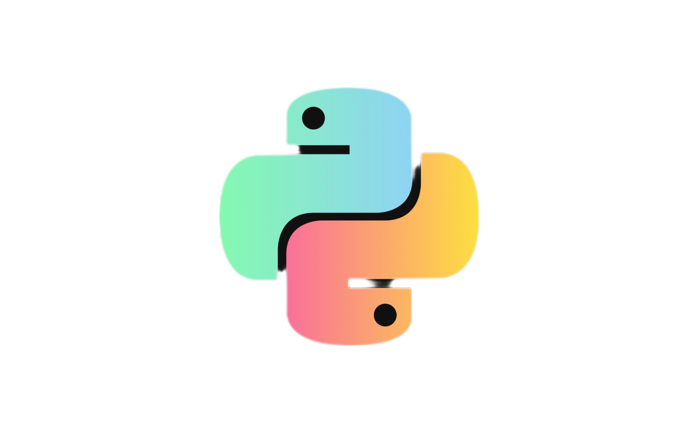
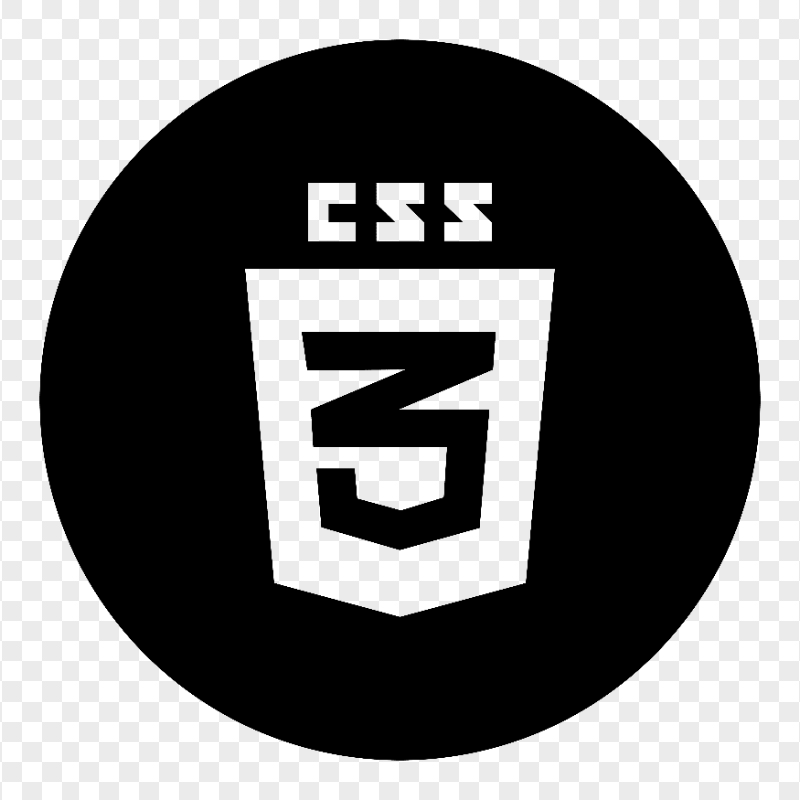

<html>
<head>
    <meta charset="UTF-8">
    <meta name="viewport" content="width=device-width, initial-scale=1.0">
</head>
<body style="background-color: black">
        

 <h1>maxHunterTz</h1>
   
<strong>Ethical Hacker | Cybersecurity Enthusiast</strong>

 
Hellow there!👋 am maxHunter from Tanzania
 
        
•offensive | deffensive security(pentester)

        
•web application | IoT security

        <h2>interest in:</h2>
        <ul>
            _linux OS
            _python
            
_javascript
            _stylesheet
            
_c++

            <h3>contact:</h3>
            
maxhunter4040@gmail.com

 </body>
</html>
